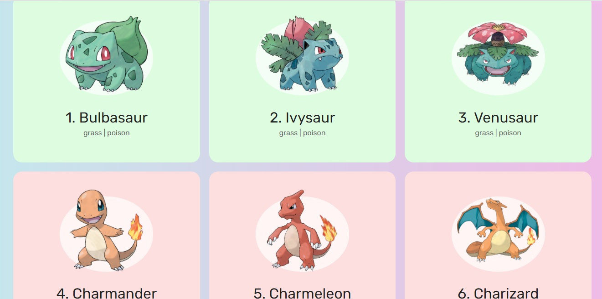
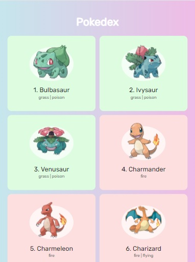

<p align="center">
  
  <h3 align="center">Pokedex</h3>
</p>

# Pokedex
Uma aplicação feita usando duas Apis, uma para imagens e outra para informações.

<p align="center">
  
</p>

## Responsividade
A aplicação foi feita tanto para se adaptar ao mobile quanto para desktops

<p align="center">
  
</p>

## Tecnologias usadas:
- HTML
- Css
- Javascript

## Como utilizar ?
```
- Clone esse repositório:
$ git clone https://github.com/SentlySS/pokedex pokedex

- Entre no diretório:
$ cd pokedex

- Execute o arquivo index.html com live server
```